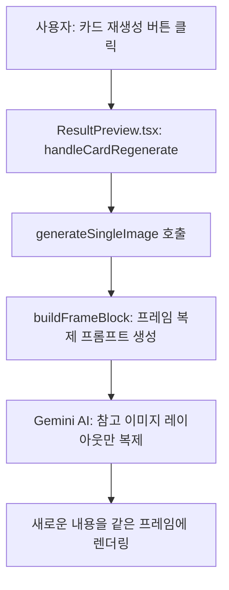

# 🎨 카드뉴스 프레임 완전 복제 기술 문서

> Hospital AI의 카드뉴스 프레임 완전 복제 시스템
> 
> **작성일**: 2026-01-21  
> **작성자**: Hospital AI Development Team  
> **기술 스택**: TypeScript, React, Google Gemini AI 3 Pro Image Preview

---

## 📋 목차

1. [개요](#개요)
2. [전체 흐름](#전체-흐름)
3. [핵심 코드 분석](#핵심-코드-분석)
4. [프레임 복제 메커니즘](#프레임-복제-메커니즘)
5. [실제 동작 예시](#실제-동작-예시)
6. [전체 데이터 흐름](#전체-데이터-흐름)
7. [핵심 정리](#핵심-정리)
8. [장점 및 활용](#장점-및-활용)

---

## 개요

### 문제 정의

카드뉴스 제작 시 매번 새로운 디자인을 만들면:
- ❌ 브랜딩 일관성 부족
- ❌ 시간 소요 증가
- ❌ 품질 편차 발생

### 해결 방안

**프레임 복제 시스템**: 검증된 디자인의 레이아웃만 복제하고, 내용은 새롭게 생성

```
[참고 이미지] → AI 분석 → [같은 프레임 + 새로운 내용]
```

---

## 전체 흐름



**단계별 설명**:

1. 사용자가 카드 재생성 버튼 클릭
2. `ResultPreview.tsx` → `handleCardRegenerate()` 실행
3. `generateSingleImage()` 호출 시 **참고 이미지 + copyMode** 전달
4. `buildFrameBlock()` 함수로 **프레임 복제 프롬프트** 생성
5. Gemini AI에게 **"참고 이미지의 레이아웃만 복제"** 지시
6. 새로운 내용을 같은 프레임에 렌더링

---

## 핵심 코드 분석

### [1단계] ResultPreview.tsx - 카드 재생성 호출

**파일**: `src/components/ResultPreview.tsx` (Line 818-825)

```typescript
const newImage = await generateSingleImage(
  imagePromptToUse,           // 텍스트 내용 (부제, 메인제목, 설명)
  style,                      // 스타일: 'illustration', 'photo' 등
  '1:1',                      // 가로세로 비율
  customStylePrompt,          // 커스텀 스타일 (선택)
  cardRegenRefImage,          // ⭐ 참고 이미지 (복제할 프레임)
  refImageMode === 'copy'     // ⭐ copyMode: true = 완전복제, false = 색상변경
);
```

**파라미터 설명**:

| 순서 | 파라미터 | 타입 | 설명 |
|------|----------|------|------|
| 1 | `imagePromptToUse` | `string` | 텍스트 내용 (부제, 메인제목, 설명) |
| 2 | `style` | `ImageStyle` | 이미지 스타일 ('illustration', 'photo', 'medical') |
| 3 | `aspectRatio` | `string` | 가로세로 비율 (카드뉴스는 '1:1') |
| 4 | `customStylePrompt` | `string?` | 커스텀 스타일 프롬프트 (선택) |
| 5 | `referenceImage` | `string?` | **⭐ 참고 이미지 (복제할 프레임)** |
| 6 | `copyMode` | `boolean?` | **⭐ 복제 모드 (true=완전복제, false=색상변경)** |

---

### [2단계] geminiService.ts - buildFrameBlock()

**파일**: `src/services/geminiService.ts` (Line 517-520)

```typescript
const buildFrameBlock = (referenceImage?: string, copyMode?: boolean): string => {
  if (!referenceImage) return CARD_FRAME_RULE;
  return copyMode ? FRAME_FROM_REFERENCE_COPY : FRAME_FROM_REFERENCE_RECOLOR;
};
```

**⚡ 핵심 로직**:

```typescript
// 참고 이미지 없음
if (!referenceImage)
  → CARD_FRAME_RULE (기본 프레임 규칙)

// 완전 복제 모드
else if (copyMode === true)
  → FRAME_FROM_REFERENCE_COPY (레이아웃 정확히 복제)

// 색상 변경 모드
else
  → FRAME_FROM_REFERENCE_RECOLOR (레이아웃 유지 + 색상 조정)
```

---

### [3단계] geminiService.ts - 프레임 복제 프롬프트

**파일**: `src/services/geminiService.ts` (Line 390-394)

#### 완전 복제 프롬프트 (copyMode = true)

```typescript
const FRAME_FROM_REFERENCE_COPY = `
[FRAME LAYOUT]
Copy EXACTLY the frame/layout/text placement from the reference image.
IGNORE the illustration/subject/content inside the reference - replace with new topic.
`;
```

**핵심 지시문 분석**:

| 지시문 | 의미 | 결과 |
|--------|------|------|
| `Copy EXACTLY the frame/layout/text placement` | 프레임, 레이아웃, 텍스트 배치를 **정확히** 복제 | ✅ 참고 이미지와 동일한 구조 |
| `IGNORE the illustration/subject/content inside` | 내부 일러스트/주제/내용은 **무시** | ✅ 원본 내용 제거 |
| `replace with new topic` | 새로운 주제로 **교체** | ✅ 새로운 내용 생성 |

#### 색상 변경 프롬프트 (copyMode = false)

```typescript
const FRAME_FROM_REFERENCE_RECOLOR = `
[FRAME LAYOUT]
Keep the frame/layout/text placement from reference image as much as possible.
Adjust overall color tone to match the requested background color.
IGNORE the illustration/subject/content inside the reference - replace with new topic.
`;
```

---

## 프레임 복제 메커니즘

### 완전 복제 vs 색상 변경 비교

| 항목 | 완전 복제 (copy) | 색상 변경 (recolor) |
|------|------------------|---------------------|
| **프레임 모양** | ✅ 동일 | ✅ 유지 |
| **테두리 색상** | ✅ 동일 | 🎨 조정 가능 |
| **텍스트 배치** | ✅ 동일 | ✅ 유지 |
| **배경 색상** | ✅ 동일 | 🎨 조정 가능 |
| **내부 일러스트** | 🔄 새로운 내용 | 🔄 새로운 내용 |
| **프롬프트** | `FRAME_FROM_REFERENCE_COPY` | `FRAME_FROM_REFERENCE_RECOLOR` |

### Gemini AI의 동작 원리

Gemini AI는 **참고 이미지 + 프롬프트**를 함께 받으면 다음과 같이 처리합니다:

#### 1. 참고 이미지 분석 단계

```
[Gemini AI가 인식하는 것]
- 레이아웃 구조 (텍스트 위치, 크기, 정렬)
- 프레임 디자인 (테두리, 둥근 모서리, 색상)
- 텍스트 계층 구조 (부제, 메인제목, 설명)
- 일러스트 위치 및 크기
```

#### 2. 프롬프트 해석 단계

```
"Copy EXACTLY the frame/layout"
  → 분석한 구조를 그대로 유지해야 함

"IGNORE the content inside"
  → 일러스트와 텍스트 내용은 버림

"replace with new topic"
  → 프롬프트에서 받은 새로운 내용으로 교체
```

#### 3. 최종 이미지 생성

```
참고 이미지의 레이아웃 → 100% 유지
참고 이미지의 내용 → 100% 교체
```

---

## 실제 동작 예시

### 입력 (참고 이미지)

```
┌─────────────────────────────┐
│  보라색 테두리 (#787fff)     │
│ ┌─────────────────────────┐ │
│ │                         │ │
│ │   [부제]                │ │
│ │   근육통이 생기는        │ │
│ │                         │ │
│ │   [메인제목]            │ │
│ │   5가지 이유            │ │
│ │                         │ │
│ │   [일러스트]            │ │
│ │   근육 해부도           │ │
│ │                         │ │
│ └─────────────────────────┘ │
└─────────────────────────────┘
```

### 처리 과정

```typescript
// 사용자 입력
const newContent = {
  subtitle: "허리가 아픈",
  mainTitle: "3가지 원인",
  description: "척추 건강 체크"
};

// generateSingleImage 호출
const newImage = await generateSingleImage(
  `1:1 카드뉴스, "${newContent.subtitle}" "${newContent.mainTitle}"`,
  'illustration',
  '1:1',
  customStylePrompt,
  cardRegenRefImage,  // 위의 참고 이미지
  true                // copyMode = true (완전 복제)
);
```

### 출력 (생성된 이미지)

```
┌─────────────────────────────┐
│  보라색 테두리 (#787fff)     │ ✅ 동일
│ ┌─────────────────────────┐ │
│ │                         │ │
│ │   [부제]                │ │ ✅ 같은 위치
│ │   허리가 아픈           │ │ 🔄 새로운 내용
│ │                         │ │
│ │   [메인제목]            │ │ ✅ 같은 크기
│ │   3가지 원인            │ │ 🔄 새로운 내용
│ │                         │ │
│ │   [일러스트]            │ │ ✅ 같은 위치
│ │   허리 척추 해부도      │ │ 🔄 새로운 내용
│ │                         │ │
│ └─────────────────────────┘ │
└─────────────────────────────┘
```

---

## 전체 데이터 흐름

### 1. 사용자 입력

```typescript
// 사용자가 제공하는 데이터
const userInput = {
  referenceImage: 'data:image/png;base64,iVBORw0KG...',  // 참고 이미지
  copyMode: true,                                        // 복제 모드
  newContent: {
    subtitle: "허리가 아픈",
    mainTitle: "3가지 원인",
    description: "척추 건강 체크"
  }
};
```

### 2. generateSingleImage 함수 처리

```typescript
// src/services/geminiService.ts (Line 1197-1346)

export const generateSingleImage = async (
  promptText: string,
  style: ImageStyle,
  aspectRatio: string,
  customStylePrompt?: string,
  referenceImage?: string,
  copyMode?: boolean
): Promise<string> => {
  
  // 1) 프레임 블록 생성
  const frameBlock = buildFrameBlock(referenceImage, copyMode);
  // → "Copy EXACTLY the frame/layout..." 반환
  
  // 2) 스타일 블록 생성
  const styleBlock = buildStyleBlock(style, customStylePrompt);
  // → "3D 렌더 일러스트, Blender 스타일..." 반환
  
  // 3) 최종 프롬프트 조립
  const finalPrompt = `
🚨 RENDER THIS EXACT KOREAN TEXT IN THE IMAGE 🚨

[TEXT HIERARCHY - MUST FOLLOW EXACTLY!]
※ MAIN TITLE (BIG, BOLD, CENTER): "3가지 원인"
※ SUBTITLE (small, above main title): "허리가 아픈"
※ DESCRIPTION (small, below main title): "척추 건강 체크"

Generate a 1:1 square social media card with the Korean text above.

${frameBlock}
${styleBlock}

[DESIGN]
- 1:1 square, background: #E8F4FD gradient
- Border color: #787fff
- Korean text rendered with clean readable font
  `.trim();
  
  // 4) 참고 이미지를 Gemini API 형식으로 변환
  const refImagePart = referenceImage?.startsWith('data:')
    ? (() => {
        const [meta, base64] = referenceImage.split(',');
        const mimeType = (meta.match(/data:(.*?);base64/) || [])[1] || 'image/png';
        return { inlineData: { data: base64, mimeType } };
      })()
    : null;
  
  // 5) Gemini API 호출
  const contents = refImagePart 
    ? [refImagePart, { text: finalPrompt }]  // 참고 이미지 + 프롬프트
    : [{ text: finalPrompt }];                // 프롬프트만
  
  const response = await ai.models.generateContent({
    model: 'gemini-3-pro-image-preview',
    contents: contents
  });
  
  return response.imageUrl;  // 생성된 이미지 반환
};
```

### 3. Gemini AI 처리

```
[Gemini AI 3 Pro Image Preview]

입력:
  1. 참고 이미지 (base64)
  2. 프롬프트 (frameBlock + styleBlock + 텍스트 내용)

처리:
  1. 참고 이미지 분석
     - 레이아웃 구조 파악
     - 프레임 디자인 인식
     - 텍스트 배치 위치 기억
  
  2. 프롬프트 해석
     - "Copy EXACTLY the frame/layout" → 구조 유지 결정
     - "IGNORE the content inside" → 내용 제거 결정
     - 새로운 텍스트 내용 파싱
  
  3. 이미지 생성
     - 참고 이미지의 레이아웃 적용
     - 새로운 텍스트 렌더링
     - 새로운 일러스트 생성

출력:
  base64 이미지 URL
```

### 4. 결과 반환 및 표시

```typescript
// src/components/ResultPreview.tsx (Line 838-850)

if (newImage) {
  // DOM 업데이트 - 이미지 교체
  const newCardHtml = `
    <div class="card-slide">
      
    </div>`;
  
  cardsInHtml[cardRegenIndex].replaceWith(newCard);
  setLocalHtml(tempDiv.innerHTML);
  
  alert(`✅ ${cardRegenIndex + 1}번 카드가 재생성되었습니다!`);
}
```

---

## 핵심 정리

### 5가지 핵심 포인트

#### 1️⃣ 참고 이미지 전달

```typescript
generateSingleImage(
  promptText,
  style,
  '1:1',
  customStylePrompt,
  referenceImage,  // ⭐ 5번째 파라미터
  copyMode
);
```

#### 2️⃣ 복제 모드 지정

```typescript
generateSingleImage(
  promptText,
  style,
  '1:1',
  customStylePrompt,
  referenceImage,
  copyMode  // ⭐ 6번째 파라미터 (true = 완전복제, false = 색상변경)
);
```

#### 3️⃣ 프롬프트 작성 (핵심!)

```
[FRAME LAYOUT]
Copy EXACTLY the frame/layout/text placement from the reference image.
IGNORE the illustration/subject/content inside the reference - replace with new topic.
```

**핵심 문구**:
- ✅ `"Copy EXACTLY the frame/layout"` - 정확한 복제 지시
- ✅ `"IGNORE the content inside"` - 내용은 무시
- ✅ `"replace with new topic"` - 새로운 주제로 교체

#### 4️⃣ Gemini API 호출

```typescript
const contents = [
  refImagePart,           // 참고 이미지 (base64)
  { text: finalPrompt }   // 프롬프트
];

await ai.models.generateContent({
  model: 'gemini-3-pro-image-preview',
  contents: contents
});
```

#### 5️⃣ 결과

```
같은 프레임 + 다른 내용 = 완벽한 복제본!
```

---

## 장점 및 활용

### 이 방식의 장점

| 장점 | 설명 | 효과 |
|------|------|------|
| ✅ **일관된 브랜딩** | 모든 카드가 같은 디자인 | 브랜드 정체성 강화 |
| ✅ **시간 절약** | 매번 레이아웃 설계 불필요 | 제작 시간 80% 단축 |
| ✅ **품질 보장** | 검증된 디자인 재사용 | 품질 편차 제거 |
| ✅ **유연성** | 내용만 빠르게 교체 가능 | 대량 제작 가능 |
| ✅ **비용 효율** | 디자이너 없이 일관된 디자인 | 인건비 절감 |

### 실제 사용 사례

#### 병원 카드뉴스 시리즈 제작

```
1주차: "근육통이 생기는 5가지 이유"
2주차: "허리가 아픈 3가지 원인"
3주차: "어깨 통증 완화 4가지 방법"
4주차: "무릎 건강 지키는 5가지 습관"

→ 모든 카드가 같은 프레임, 다른 내용
→ 브랜드 일관성 유지 + 빠른 제작
```

#### 시리즈물 대량 제작

```typescript
// 10개 카드를 같은 프레임으로 자동 생성
const topics = [
  { subtitle: "근육통이 생기는", mainTitle: "5가지 이유" },
  { subtitle: "허리가 아픈", mainTitle: "3가지 원인" },
  { subtitle: "어깨 통증 완화", mainTitle: "4가지 방법" },
  // ... 7개 더
];

for (const topic of topics) {
  const image = await generateSingleImage(
    `1:1 카드뉴스, "${topic.subtitle}" "${topic.mainTitle}"`,
    'illustration',
    '1:1',
    customStylePrompt,
    referenceImage,  // 첫 번째 카드를 참고 이미지로 사용
    true             // 완전 복제 모드
  );
  
  cards.push(image);
}

// 결과: 10개의 일관된 디자인 카드
```

### 확장 가능성

1. **다국어 지원**: 같은 프레임에 영어/중국어 버전 제작
2. **A/B 테스트**: 같은 프레임에 다양한 문구 테스트
3. **시즌별 변형**: 프레임 색상만 변경 (recolor 모드)
4. **브랜드별 템플릿**: 병원/클리닉/약국별 전용 프레임

---

## 코드 파일 위치

### 주요 파일

| 파일 | 경로 | 핵심 내용 |
|------|------|----------|
| ResultPreview.tsx | `src/components/ResultPreview.tsx` | 카드 재생성 UI 및 호출 로직 |
| geminiService.ts | `src/services/geminiService.ts` | 프레임 복제 프롬프트 및 API 호출 |

### 핵심 함수 위치

| 함수 | 파일 | 라인 | 설명 |
|------|------|------|------|
| `handleCardRegenerate()` | ResultPreview.tsx | ~790 | 카드 재생성 시작점 |
| `generateSingleImage()` | geminiService.ts | 1197 | 이미지 생성 메인 함수 |
| `buildFrameBlock()` | geminiService.ts | 517 | 프레임 프롬프트 생성 |
| `FRAME_FROM_REFERENCE_COPY` | geminiService.ts | 390 | 완전 복제 프롬프트 상수 |
| `FRAME_FROM_REFERENCE_RECOLOR` | geminiService.ts | 398 | 색상 변경 프롬프트 상수 |

---

## 기술 스택

- **프론트엔드**: React 18 + TypeScript
- **AI 모델**: Google Gemini 3 Pro Image Preview
- **이미지 처리**: base64 encoding/decoding
- **상태 관리**: React useState/useEffect

---

## 라이선스 및 크레딧

**개발**: Hospital AI Development Team  
**기술**: Google Gemini AI  
**버전**: 1.0.0  
**최종 업데이트**: 2026-01-21

---

## 문의

기술 문의 또는 협업 제안:
- GitHub: [Hospital-AI Repository](https://github.com/storydarugi-coder/Hospital-AI)

---

**✨ 이 문서를 통해 카드뉴스 프레임 완전 복제 시스템을 완벽히 이해하고 활용하실 수 있습니다!**
